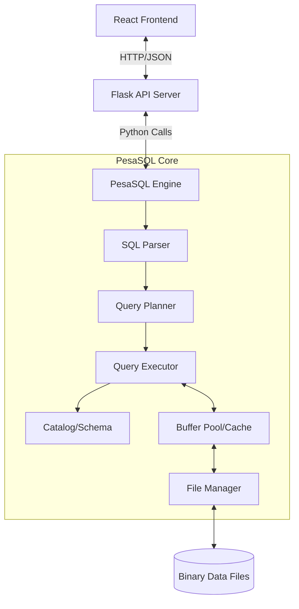

# PesaSQL Database System

PesaSQL is a custom-built Relational Database Management System (RDBMS) written from scratch in Python, paired with a modern React-based Fintech interface. This project demonstrates the core internal mechanisms of a database engine, including parsing, query planning, execution, and binary storage, integrated into a full-stack web application.

## System Architecture

The system operates as a three-tier architecture:

1.  **Frontend (Client)**: A React/Vite Single Page Application (SPA) that provides a dashboard for Merchants to manage transactions and customers.
2.  **Middleware (Server)**: A Flask Python application that acts as the database driver and API layer, translating HTTP requests into PesaSQL internal calls.
3.  **Storage Engine (PesaSQL)**: The core embedded database engine that manages data on disk using custom binary file formats.



---

##  Core Database Components & Design

### 1. Storage Engine (`src/pesasql/storage`)
Unlike simple JSON or CSV stores, PesaSQL implements a **Heap File Organization** using fixed-size binary pages (default 4KB).

*   **File Manager (`file_manager.py`)**: Manages the OS-level file handles. It treats the database file as a collection of numbered pages.
*   **Page Structure (`page.py`)**: Implementation of the "Slotted Page" concept (simplified).
    *   **Header**: Contains metadata like Page ID, LSN (Log Sequence Number), Page Type, and Free Space Pointers.
    *   **Body**: Stores rows sequentially or via offsets.
    *   **Design Decision**: Using binary serialization allows for efficient implementation of data types (Integers as fixed 4-byte, Strings as length-prefixed bytes) and prepares the system for future buffer pool optimizations.

### 2. Query Engine (`src/pesasql/query`)
The query processing pipeline mimics standard commercial databases:

*   **Execution Model**: The executor currently uses a **Tuple-at-a-time** (Iterator) model for scanning, but often materializes results for JOIN operations to simplify complexity.
*   **Join Strategies**:
    *   **Nested Loop Join**: Simple reference implementation.
    *   **Hash Join**: Implemented for performance on equi-joins (building a hash table on the inner relation).
*   **Delete/Update Logic**:
    *   **Compaction**: `DELETE` operations rewrite the page by filtering out deleted rows and compacting the remaining data. This prevents fragmentation but incurs a higher I/O cost per delete (Tradeoff: Simplicity vs Performance).

### 3. Parser & AST (`src/pesasql/parser`)
*   **Lexer**: Tokenizes raw SQL strings.
*   **Parser**: A Recursive Descent parser that constructs an **Abstract Syntax Tree (AST)**.
*   **Design Decision**: Hand-writing the parser instead of using a generator (like ANTLR) provides deeper insight into SQL grammar nuances and error handling.

---

## Database Schema

The system implements a Fintech-oriented schema:

*   **Users**: System access authentication.
*   **Merchants**: Business profiles linked to Users.
*   **Customers**: End-users transacting with merchants.
*   **Transactions**: Financial records linking Merchants and Customers.

**Key constraints:**
*   `FOREIGN KEY` support was implemented in the Parser/AST to link tables (e.g., Transactions referencing Merchants).
*   `DEFAULT` values handle automatic timestamp generation.

---

##  Getting Started

### Prerequisites
*   **Python 3.8+**
*   **Node.js 16+ & npm**

### 1. Starting the Backend (Server + DB Engine)

The backend initializes the PesaSQL engine and serves the API.

```bash
# Navigate to project root
cd /home/jasper-munene/Document/pesasql

# Install Python dependencies
pip install -r requirements.txt

# Run the server
python3 run_app.py
```
*Expected Output:* `Starting PesaSQL Web Interface on http://localhost:5000`

### 2. Starting the Frontend (Client)

The frontend connects to the running backend.

```bash
# Open a new terminal and navigate to client
cd client

# Install Node dependencies
npm install

# Start development server
npm run dev
```
*Expected Output:* `Vite --host` accessible at `http://localhost:5173`. 

### 3. Accessing the Application

1.  Open your browser to `http://localhost:5173`.
2.  **Register a new account** (The DB starts fresh if `finance.db` was deleted).
3.  Navigate to **Merchants** to view your profile.
4.  Use **Customers** to add/delete customers.
5.  **Simulate Transactions** using the POS Terminal or Transaction API.

---

## Extension Points

*   **Indexing**: The `IndexManager` exists but `CREATE INDEX` SQL parsing is currently disabled. Re-enabling this would allow B-Tree lookups.
*   **Concurrency**: The system currently runs single-threaded for unsafe operations. Implementing locks in `Page` or `Table` level would be the next step for ACID compliance.
*   **Buffer Pool**: Implementing a replacement policy (LRU/Clock) in `FileManager` would significantly reduce disk I/O.

---

## Resources

*   [Let's Build a Simple Database](https://cstack.github.io/db_tutorial/) by cstack - A massive inspiration for the architecture of the PesaSQL storage engine and Pager implementation.

This project utilized AI-powered tools to assist with:
*   **UI Development**: Generating and iterating on React component code for the frontend dashboard.
*   **Debugging**: Identifying and resolving issues across the PesaSQL engine and Flask API layer.

